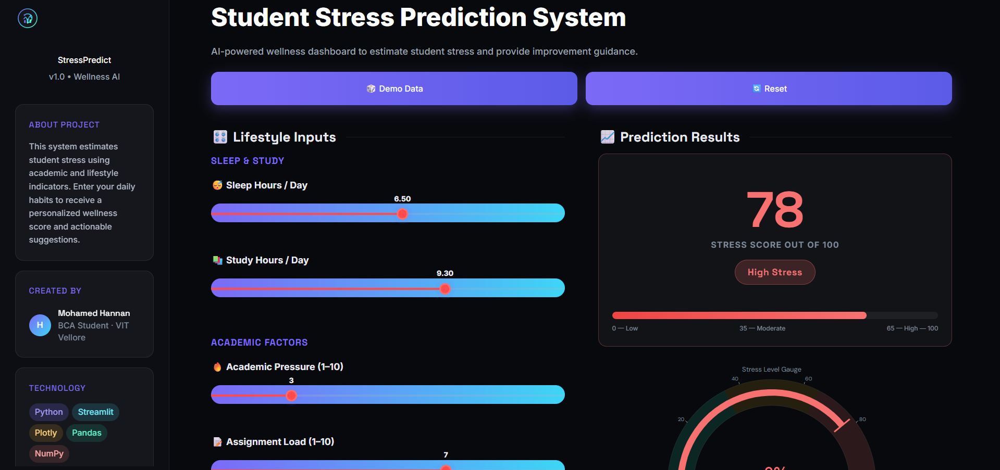
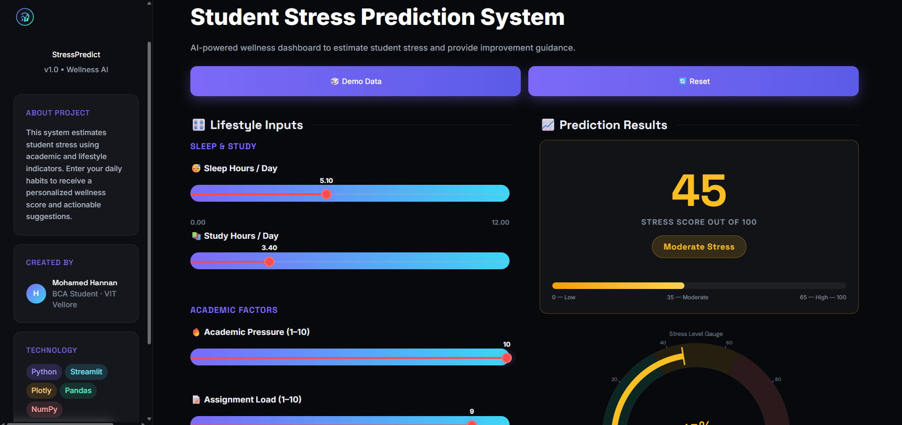
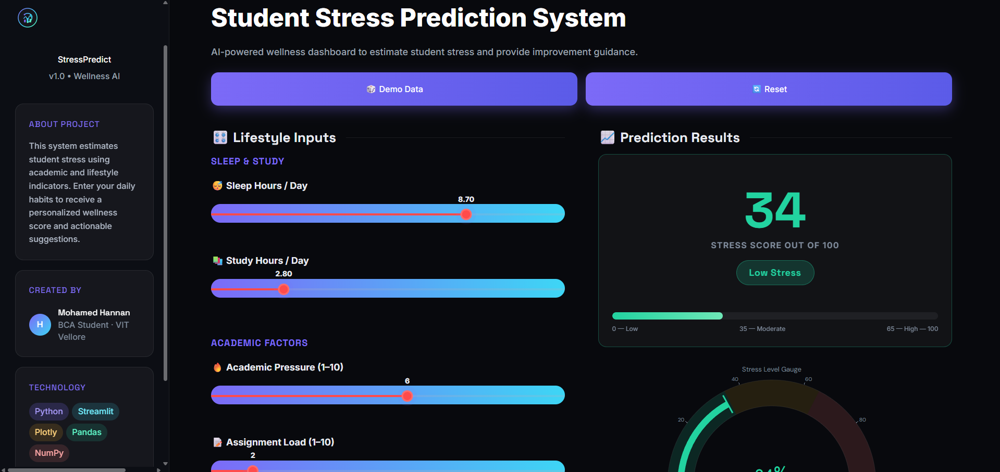
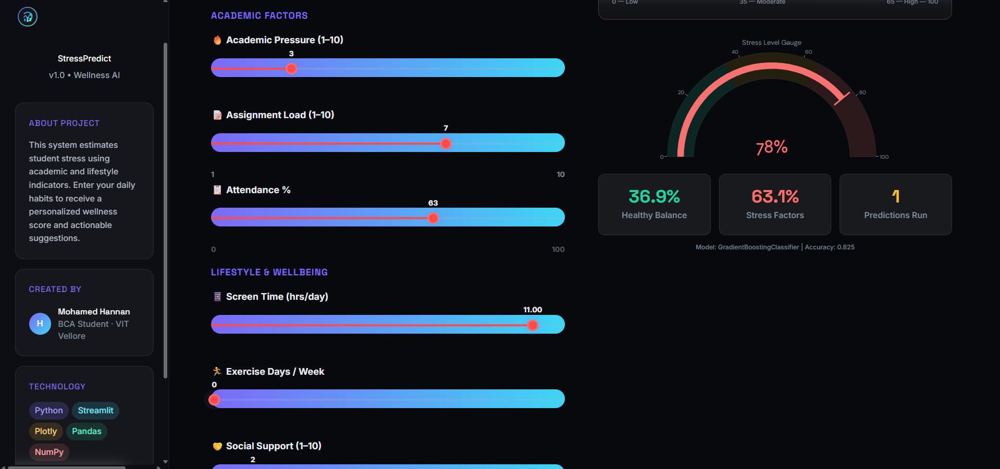
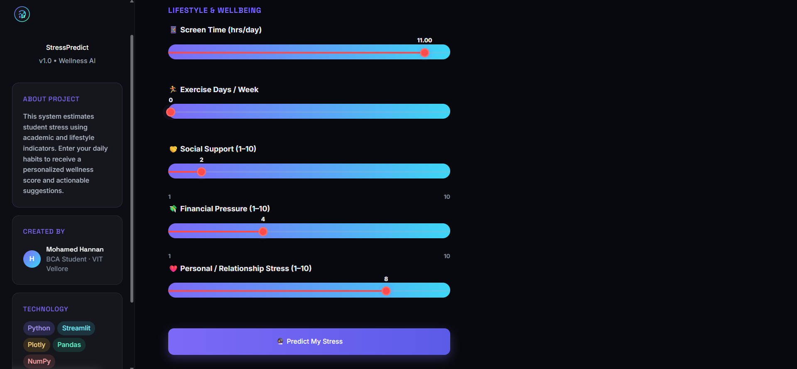
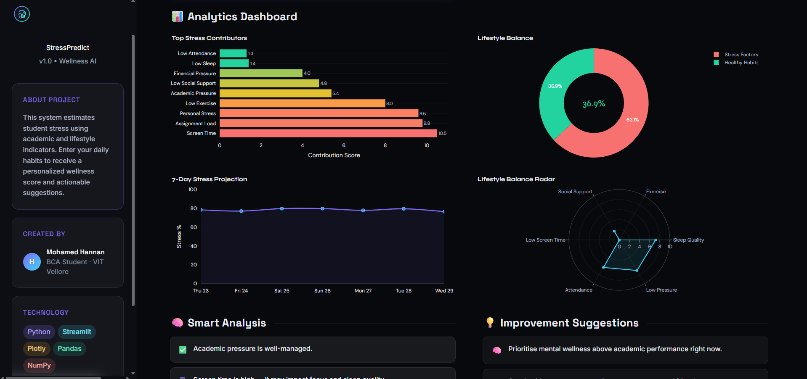
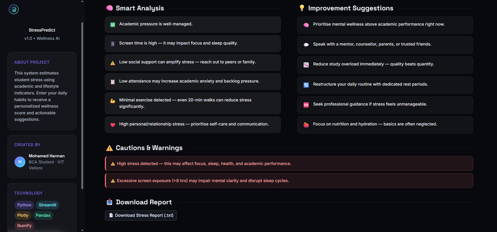

# 🎓 Student Stress Prediction System

<p align="center">
  <b>AI-Powered Wellness Dashboard for Predicting Student Stress Levels</b><br>
  Built using Machine Learning, Streamlit, and Interactive Data Visualization.
</p>

---

## 📌 Overview

The **Student Stress Prediction System** is a smart web-based application designed to estimate the stress level of students using various academic, personal, and lifestyle indicators.

Students today face stress due to studies, assignments, exams, screen time, sleep imbalance, and personal pressure. This system uses Machine Learning algorithms to analyze those inputs and generate a **stress score out of 100**, along with intelligent wellness suggestions.

This project combines **AI + UI + Data Analytics** into a premium modern dashboard.

---

## 🚀 Features

✅ Predict student stress score instantly  
✅ Classify stress level as Low / Moderate / High  
✅ Personalized wellness suggestions  
✅ Smart insights based on entered data  
✅ Beautiful analytics charts using Plotly  
✅ Download stress report as TXT file  
✅ Premium responsive dark UI  
✅ Interactive sliders and controls  
✅ Streamlit sidebar dashboard layout  
✅ Real-time predictions

---

## 🧠 Machine Learning Workflow

The system uses student lifestyle data and applies machine learning techniques:

- Data Cleaning
- Feature Selection
- Model Training
- Model Evaluation
- Prediction Generation
- Result Visualization

Possible algorithms used:

- Linear Regression
- Random Forest
- Decision Tree
- Gradient Boosting
- Ensemble Models

---

## 📊 Input Parameters

The prediction is based on the following factors:

| Parameter | Description |
|----------|-------------|
| 😴 Sleep Hours | Average sleep per day |
| 📚 Study Hours | Study time per day |
| 🔥 Academic Pressure | Stress from academics |
| 📝 Assignment Load | Number/intensity of tasks |
| 📱 Screen Time | Mobile/Laptop usage |
| 🏃 Exercise Days | Physical activity frequency |
| 📋 Attendance | Attendance percentage |
| 🤝 Social Support | Friends/family support |
| 💸 Financial Pressure | Money-related stress |
| ❤️ Personal Stress | Relationship/personal pressure |

---

## 📈 Output Generated

After prediction, the system provides:

- 🎯 Stress Score (0 - 100)
- 🟢 Low Stress
- 🟡 Moderate Stress
- 🔴 High Stress
- 📊 Gauge Chart
- 📉 Trend Charts
- 🧠 Insights
- 💡 Suggestions
- 📥 Downloadable Report

---

## 🛠️ Tech Stack

### Frontend / UI
- Streamlit
- HTML
- CSS
- Custom Sidebar Styling

### Backend
- Python

### Data Science / ML
- Pandas
- NumPy
- Scikit-learn

### Visualization
- Plotly

---

## 📂 Project Structure

```bash
Student-Stress-App/
├── app.py
├── model.py
├── style.css
├── requirements.txt
├── README.md
├── student_lifestyle_dataset_Final.csv
├── premium_brain_logo.svg
├── hide_streamlit.css
├── saved_model.pkl
└── TODO.md
```

## ⚙️ Installation Guide

### 1️⃣ Clone Repository
```bash
git clone https://github.com/Hannan01-nil/Student-Stress-App.git
cd Student-Stress-App
```

### 2️⃣ Install Dependencies
```bash
pip install -r requirements.txt
```

### 3️⃣ Run Application
```bash
streamlit run app.py
```

## 📷 UI Preview

**Dashboard Includes:**
- Sidebar Information Cards
- Input Sliders
- Stress Result Card
- Gauge Meter
- Analytics Dashboard
- Suggestions Panel

---

### 1. Home Dashboard



---

### 2️. Moderate Stress Prediction



---

### 3️. Low Stress Prediction



---

### 4️. High Stress Gauge Analysis



---

### 5️. Lifestyle Input Controls



---

### 6️. Analytics & Charts Section



---

### 7️. Suggestions & Recommendations Panel



## 💡 Why This Project Matters

Student mental health is an important modern issue. This project helps:

- Detect early stress signals
- Increase awareness
- Encourage healthy habits
- Promote data-driven wellness support

## 👨‍💻 Author

**Mohamed Hannan**

🎓 BCA Student - VIT Vellore  
💻 Full Stack & AI Enthusiast

📧 **Email:** mohamedhannan01@gmail.com

🔗 **GitHub:** https://github.com/Hannan01-nil 
🔗 **LinkedIn:** https://www.linkedin.com/in/mohamed-hannan-9703763a0

---

© 2024 Mohamed Hannan | Built with ❤️ using Python & Streamlit
